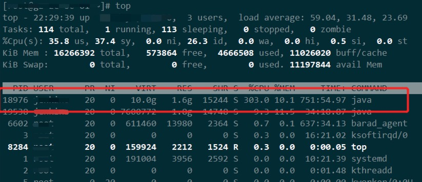
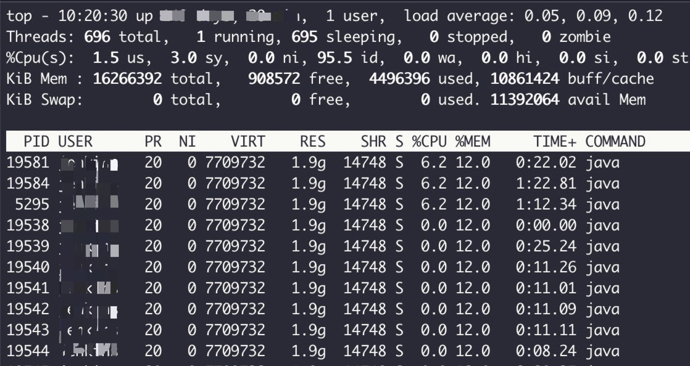
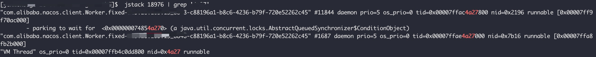

# 问题
运维反馈线上应用cpu占用很高。登上机器，top查看下

cpu飙到了300%...

# 排查
1. `top`命令获取cpu飙高应用的pid，即18976

2. `top -Hp <pid>`命令查看应用的线程


3. `printf '%x\n' <pid-thread>`命令将<font color="#dd0000">线程pid</font>转换成16进制`pid-thread-hex`


4. `jstack <pid> | grep '<pid-thread-hex>'`<span id="fourhStepJump">命令查看线程信息</span>


# 解决
到[第4步](#fourhStepJump)发现是nacos的线程一直在工作。

之前在测试环境也遇到过，是因为nacos触发了spring cloud的refreshContext，重新加载上下文，但是Hikaricp Datasource数据源不允许二次更新，导致nacos更新失败，md5值也未更新成功，最终导致nacos一直在刷新。

在配置文件中加入：
```
spring.cloud.refresh.extra-refreshable=javax.sql.DataSource
```
refreshContext的时候排除Datasource，问题解决